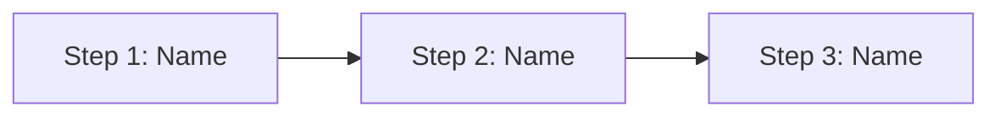

Perfeito. Vou criar um template abrangente de Jornada do Usuário focado em workflows internos (como ferramentas internas, dashboards e portais para colaboradores), usando formatação em Markdown, um exemplo de diagrama visual em MermaidJS e uma versão em YAML para preenchimento estruturado.

Já inicio a montagem e te trago o conteúdo completo em instantes.


# Internal Tool User Journey Template

## Journey Title

*Provide a clear name or identifier for this user journey (e.g., "Employee Onboarding Process").*

## Persona

*Which internal user persona or employee group is this journey based on? Describe their role, goals, and needs (e.g., "New Hire", "IT Support Engineer", "HR Manager").*

## Scenario / Context

*What is the business process, workflow, or situation being mapped? Why is it important? Outline the context and objectives. (For example: "Onboarding a new employee into all relevant internal systems – this is crucial to ensure productivity from Day 1.")*

## Journey Stages / Steps

*Break down the journey into discrete stages or steps. For each step, include the following details:*

1. **Step 1 Name** – *Brief description of what happens in this step.*

   * **User Actions:** What does the user do at this step? (e.g., fills out a form, requests access)
   * **System Actions:** What does the system/tool do in response? (e.g., sends confirmation email, logs the request)
   * **Entry Criteria:** Conditions that must be met to begin this step (e.g., user has an active account, user received an invite).
   * **Exit Criteria:** Conditions that signify this step is complete (e.g., user successfully logged in, request is submitted and acknowledged).
   * **Pain Points & Frustrations:** What challenges might the user encounter here? (e.g., confusing UI, slow load times, lack of guidance).
   * **Opportunities & Recommendations:** How could this step be improved? (e.g., streamlining the form, adding tooltips, automating a sub-task).
   * **Success Indicators:** How do we measure success for this step? (e.g., time to complete the step, error rate, user satisfaction feedback).

2. **Step 2 Name** – *Brief description of what happens in this step.*

   * **User Actions:** What does the user do at this step?
   * **System Actions:** What does the system/tool do in response?
   * **Entry Criteria:** Prerequisites for this step to start.
   * **Exit Criteria:** How do we know this step is finished?
   * **Pain Points & Frustrations:** Challenges or friction in this step.
   * **Opportunities & Recommendations:** Suggestions to improve this step.
   * **Success Indicators:** Metrics or signs of a successful step.

*Continue listing steps as needed for the entire journey.*

## Emotions & Experience Mapping

*Describe the user’s emotional journey through each stage. Note highs, lows, points of confusion or delight.*

* **Step 1:** *\[Emotion]* – Why does the user feel this way? (e.g., 😀 **Excited** – the interface is new and engaging.)
* **Step 2:** *\[Emotion]* – Rationale for this emotion (e.g., 😕 **Confused** – instructions are unclear at this stage.)
* **Step 3:** *\[Emotion]* – ...and so on for each step in the journey.

*Optionally, you can visualize this as an emotional curve chart, illustrating peaks (positive experiences) and valleys (pain points) across the journey.*

## Visual Journey Map

*High-level flow of the journey steps and transitions (using MermaidJS for a flowchart).*



## Supporting Systems & Integrations

*List any systems, teams, or processes that intersect with this journey (internal tools, databases, APIs, departments involved, etc.). For each, you may include a brief note on how they are involved.*

* **System/Tool 1:** *Role or interaction in this journey (e.g., "HR Onboarding Portal – used to enter new hire data").*
* **System/Tool 2:** *Role or interaction (e.g., "Email Service – sends notification to IT support").*
* **Team/Dept 1:** *Involved team and their role (e.g., "IT Support Team – provisions hardware at Step 3").*

## Assumptions & Constraints

*Document any assumptions, rules, or limitations we are making in this journey.*

* *Assumption:* e.g., "All users have single sign-on (SSO) access by the start of this journey."
* *Assumption:* e.g., "User has completed required training before Step 2."
* *Constraint:* e.g., "System updates can only be deployed during off-hours, affecting Step 4 timing."
* *Constraint:* e.g., "Limited support staff available on weekends, which may slow the process."

## Revision History

*Track changes to this journey map over time.*

| Version | Date       | Description            | Author        |
| ------- | ---------- | ---------------------- | ------------- |
| 0.1     | 2025-06-23 | Initial draft template | Your Name     |
| 1.0     | YYYY-MM-DD | First complete version | Approver Name |

## Approval & Sign-off

*List the stakeholders who must review and approve this journey.*

* **Product Owner/Manager:** *Name*
* **UX Lead:** *Name*
* **Engineering Lead:** *Name*
* *(Add other roles as needed, e.g., Security Officer, QA Manager.)*

## YAML Template

*Below is a YAML representation of this template for structured data use (e.g., in Notion or other tools). You can fill this out with the journey details in YAML format.*

```yaml
journey_title: "Internal Tool Journey Name (e.g., Employee Onboarding Process)"
persona: "Persona or User Group (e.g., New Hire)"
scenario: "Brief description of the scenario/context being mapped."
stages:
  - name: "Step 1 Name"
    description: "Brief description of what happens in Step 1."
    user_actions: "What does the user do in this step?"
    system_actions: "How does the system respond or support the user in this step?"
    entry_criteria: "Conditions required before this step begins."
    exit_criteria: "Outcome or conditions that mark the end of this step."
    pain_points: "Pain points or frustrations encountered in this step."
    opportunities: "Improvement opportunities or recommendations for this step."
    success_indicators: "How to measure success for this step."
  - name: "Step 2 Name"
    description: "Brief description of what happens in Step 2."
    user_actions: "User's actions in this step."
    system_actions: "System's actions/responses in this step."
    entry_criteria: "Prerequisites for Step 2."
    exit_criteria: "What indicates Step 2 is complete?"
    pain_points: "Pain points in Step 2."
    opportunities: "Improvement ideas for Step 2."
    success_indicators: "Metrics or signs of success for Step 2."
  # ... Continue for all steps in the journey
emotions:
  - step: "Step 1 Name"
    emotion: "User emotion at Step 1 (e.g., Excited, Confused)"
    notes: "Optional explanation of why the user feels this way."
  - step: "Step 2 Name"
    emotion: "User emotion at Step 2 (e.g., Frustrated, Relieved)"
    notes: "Optional explanation for the emotion."
  # ... Continue for all steps
visual_journey_map: |
  flowchart LR
    A[Step 1: Name] --> B[Step 2: Name]
    B --> C[Step 3: Name]
    %% Include additional MermaidJS flowchart syntax as needed %%
supporting_systems:
  - "System or Tool 1 (e.g., HR Portal)"
  - "System or Tool 2 (e.g., Email Service)"
  - "Team or Dept 1 (e.g., IT Support Team)"
assumptions:
  - "Assumption 1 (e.g., All users have SSO access prior to starting.)"
  - "Assumption 2 (e.g., Required training is completed before Step 2.)"
  - "Constraint 1 (e.g., Deployments only occur after hours.)"
revision_history:
  - version: "0.1"
    date: "2025-06-23"
    description: "Initial draft of the journey map."
    author: "Your Name"
  # Add more revision entries as needed
approval:
  - "Product Owner/Manager: [Name]"
  - "UX Lead: [Name]"
  - "Engineering Lead: [Name]"
  # Add other approvers as needed
```
